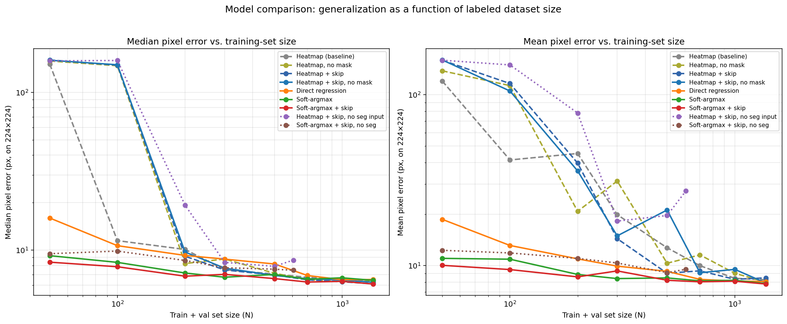

# Laser Weeding — Keypoint Targeting

This repository contains the dataset, training scripts, and experimental results
for the laser-weeding keypoint prediction pipeline. The goal of the project is
to aim a laser precisely at the **meristem** (growth point) of each pigweed
plant detected in the field, so the weed can be destroyed without damaging
nearby crops.

---

## Where to start

| You want to… | Go here |
|---|---|
| **Reproduce the end-to-end paper table** (keypoint vs heatmap × YOLO-detect vs YOLO-segment + pose baseline, on the Oxnard test split) | [`oxnard_pipeline/README.md`](oxnard_pipeline/) — full step-by-step recipe |
| Retrain the Phase-1 segmentation model `best_pigweed_145.pt` | [`Oxnard-Pigweed-1/README.md`](Oxnard-Pigweed-1/) — Roboflow export + YOLO command |
| Reproduce the older Phase-2 architecture sweeps (heatmap vs soft-argmax vs direct, across data sizes) | The "Reproducing the results" section below + `scripts/*_sweep.py` |

The headline end-to-end result is in [`oxnard_pipeline/README.md`](oxnard_pipeline/README.md):
**seg + heatmap (soft-argmax) → mean Dist 3.77 / median 2.83** on the held-out test split.

---

## Motivation

In precision agriculture, computer-vision-guided lasers offer a chemical-free
alternative to herbicides, but the economics only work if we can hit the
meristem reliably. Missing by more than a few millimeters wastes the shot, and
hitting the crop instead of the weed damages yield. Our target is **median
pixel error below ~8 px on a 224×224 crop**, which translates to sub-centimeter
targeting accuracy at typical field resolutions.

The headline question of this work is: **given a fixed labeling budget, which
model architecture gets us to reliable targeting with the least training
data?** We evaluated seven model variants across nine dataset sizes, all
measured on the same fixed 344-image held-out test set.

---

## Pipeline

The deployed system is a **two-stage pipeline**:

```
Field image
   │
   ▼
[ YOLO (segmentation or detection) ]  ─────  finds pigweed plants
   │
   ▼
Cropped plant (224×224)
   │
   ▼
[ Meristem keypoint model ]  ────────────────  predicts (x, y) laser target
   │
   ▼
(x, y) laser coordinate
```

The YOLO stage is responsible for recall (find every weed); the keypoint stage
is responsible for precision (hit the growth point, not the leaf). This repo
focuses on **the keypoint stage** — specifically, architectural choices that
govern how accurately it localizes the meristem and how much labeled data it
needs to do so.

---

## Methods compared

| # | Variant | Backbone | Output head | Training signal |
|---|---------|----------|-------------|-----------------|
| 1 | Heatmap baseline | MobileNetV3-Small | Transpose-conv decoder → sigmoid heatmap | MSE on masked Gaussian heatmap |
| 2 | Heatmap, no mask | MobileNetV3-Small | Same as #1 | MSE on clean Gaussian heatmap |
| 3 | Heatmap + skip | MobileNetV3-Small | U-Net style decoder with skip connections | MSE on masked Gaussian heatmap |
| 4 | Heatmap + skip, no mask | MobileNetV3-Small | U-Net style decoder | MSE on clean Gaussian heatmap |
| 5 | **Direct regression** | MobileNetV3-Small | GAP → FC → (x, y) | SmoothL1 on coordinates |
| 6 | Soft-argmax | MobileNetV3-Small | 2D score map → spatial softmax → weighted-sum (x, y) | SmoothL1 on coordinates |
| 7 | **Soft-argmax + skip** | MobileNetV3-Small | U-Net decoder → 2D score map → spatial softmax → (x, y) | SmoothL1 on coordinates |

All variants share the same encoder backbone, the same augmentation pipeline
(horizontal/vertical flip, ±180° rotation, color jitter), and the same
train/val/test protocol (75/25 split within a labeling budget, same fixed 20%
test set across every run).

---

## Key figure

Mean and median pixel error on the fixed test set as a function of the
train+val budget size:



The two clear takeaways from this plot:

1. **Soft-argmax + skip (red) is dominant across every dataset size.** It
   matches the best-in-class accuracy at large N and is the only model that
   stays accurate at small N, when every pure-heatmap variant collapses to
   >100 px error.
2. **Pure heatmap models are data-hungry and unstable** below ~200 labeled
   images. Dashed lines in both panels cliff-dive on the left.

---

## Featured results

Per our request for the advisor meeting, three models get detailed tables:
the direct regression keypoint baseline, the best heatmap variant
(soft-argmax + skip), and the best heatmap variant evaluated on
**un-segmented** input crops (so the pipeline could use YOLO detection instead
of YOLO segmentation, which is much faster at inference time).

### 1. Direct regression (keypoint baseline)

MobileNetV3-Small backbone → Global Average Pool → Linear(576→256) →
Linear(256→2). Loss: SmoothL1 on (x, y) coordinates.

| N (train + val) | Mean px error | Median px error |
|:-:|:-:|:-:|
| 1374 | 8.07 | 6.52 |
| 1000 | 8.13 | 6.49 |
| 700  | 8.31 | 6.91 |
| 500  | 9.26 | 8.17 |
| 300  | 9.93 | 8.78 |
| 200  | 10.96 | 9.26 |
| 100  | 13.12 | 10.68 |
| 50   | 18.65 | 15.99 |

### 2. Soft-argmax + skip (best heatmap, segmented input)

MobileNetV3-Small encoder split into 3 stages; U-Net decoder with skip
connections from 28×28 and 14×14 feature maps; 1×1 conv to a single-channel
56×56 score map; spatial softmax over the score map; expected (x, y) obtained
by multiplying the probability grid against coordinate grids and summing.
Loss: SmoothL1 on coordinates.

| N (train + val) | Mean px error | Median px error |
|:-:|:-:|:-:|
| 1374 | **7.81** | **6.10** |
| 1000 | 8.11 | 6.34 |
| 700  | 8.04 | 6.28 |
| 500  | 8.22 | 6.60 |
| 300  | 9.32 | 7.03 |
| 200  | 8.60 | 6.84 |
| 100  | 9.49 | 7.85 |
| 50   | 10.04 | 8.39 |

Best-in-class at every dataset size. Mean and median stay tightly coupled at
every N — no catastrophic tail, unlike every pure-heatmap variant.

### 3. Soft-argmax + skip, un-segmented input

Same architecture as #2, trained on crops that have **not** been
foreground-segmented. This is the relevant configuration for a deployment
pipeline that uses YOLO detection (box-only, faster) instead of YOLO
segmentation. Dataset is smaller here because only 758 of the 1718 labeled
crops have a matching un-segmented counterpart.

| N (train + val) | Mean px error | Median px error |
|:-:|:-:|:-:|
| 606 | 9.52 | 7.46 |
| 500 | 9.10 | 7.58 |
| 300 | 10.36 | 7.74 |
| 200 | 11.02 | 8.60 |
| 100 | 11.86 | 9.87 |
| 50  | 12.29 | 9.50 |

Performance degrades slightly vs. segmented input (median 7.46 vs. 6.10 at
largest N), but the degradation is graceful and the model is still robust at
every dataset size. This is a favourable trade: losing ~1 px of median
accuracy buys us a much faster YOLO detection stage at inference time.

---

## Repo structure

```
laser-weeding/
├── README.md                         ← this file (front door)
├── oxnard_pipeline/                  ← END-TO-END PIPELINE: keypoint vs heatmap × det vs seg
│   ├── README.md                     ←   start here to reproduce the paper table
│   ├── 01_prep.py                    ←   builds detection + masked-crop datasets
│   ├── build_unmasked_crops.py       ←   builds raw-crop dataset (no segmentation)
│   ├── 04_phase1_pose_prep.py        ←   builds the YOLO-pose dataset
│   ├── train_keypoint_v2.py          ←   Phase-2 trainer (KP_ARCH × KP_CROPS, 4 cells)
│   └── compare_all.py                ←   end-to-end eval + chart generation
├── Oxnard-Pigweed-1/                 ← Roboflow seg dataset → trains best_pigweed_145.pt
│   └── README.md
├── data/
│   └── keypoint_labels/              ← (x, y) pixel labels, one .txt per image
├── figures/
│   └── comparison.png                ← mean/median error vs N, all methods (Phase-2 sweeps)
├── results/
│   ├── comparison/                   ← end-to-end comparison output (JSON + 2 charts)
│   ├── sweeps/                       ← raw CSV for every Phase-2 sweep variant
│   └── outlier_analysis/             ← worst-case prediction plots for heatmap
└── scripts/
    ├── segment_processing.py         ← data prep: segmentation → cropped plant
    ├── keypoint_labeling.py          ← (x, y) annotation tool
    ├── keypoint_training.py          ← single-model training
    ├── keypoint_testing.py           ← inference
    ├── plot_comparison.py            ← regenerates figures/comparison.png
    ├── heatmap_outlier_analysis.py   ← per-image error histograms, worst-K plots
    ├── generalization_sweep.py       ← #1  heatmap (mask)
    ├── nomask_sweep.py               ← #2  heatmap, no mask
    ├── skipconn_sweep.py             ← #3  heatmap + skip
    ├── nomask_skip_sweep.py          ← #4  heatmap + skip, no mask
    ├── regression_sweep.py           ← #5  direct regression
    ├── softargmax_sweep.py           ← #6  soft-argmax
    ├── softargmax_skip_sweep.py      ← #7  soft-argmax + skip  (best)
    ├── nomask_skip_noseg_sweep.py    ← no-segment input variant
    └── softargmax_skip_noseg_sweep.py← no-segment input variant
```

The image crops themselves are **not** version-controlled (too large); they
live on the lab Box drive. Labels are small text files and are tracked here.

---

## Reproducing the results

```bash
# Env setup
conda create -n yolo26 python=3.11 -y
conda activate yolo26
pip install torch torchvision opencv-python scikit-learn matplotlib

# Re-run any sweep (example: the best model)
cd scripts
python softargmax_skip_sweep.py

# Regenerate the comparison figure once sweeps are done
python plot_comparison.py
```

Each sweep script uses `random_state=42` throughout (train/val/test split,
subsampling at each N), so runs are reproducible. All sweeps share the same
fixed 344-image test set carved off at the start.

---